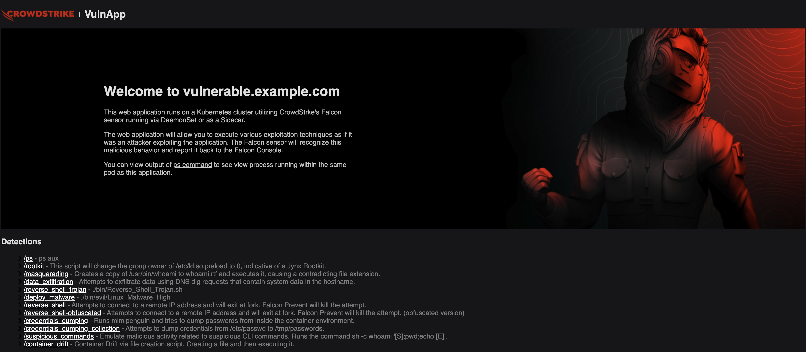

[](https://github.com/igorschultz/vulapp/actions/workflows/container_build.yml)

# CrowdStrike's VulnApp

CrowdStrike's VulnApp is a demo container designed to support container-related detection and response testing. It contains several use cases embedded within its image and can be triggered via a web page exposed through a Kubernetes service. All testing is performed locally, meaning it won't impact other containers and applications within your Kubernetes cluster.

VulnApp uses the [detection-container](https://github.com/CrowdStrike/detection-container) as its base image, including its use cases and making their execution available through a web service.

 </img>

## Use Cases

| Name | Description |
|:-----|:------------|
| [Rootkit](https://github.com/CrowdStrike/detection-container/blob/main/bin/Defense_Evasion_via_Rootkit.sh) | This script will change the group owner of `/etc/ld.so.preload` to `0`, indicative of a Jynx Rootkit. |
| [Masquerading](https://github.com/CrowdStrike/detection-container/blob/main/bin/Defense_Evasion_via_Masquerading.sh) | Creates a copy of `/usr/bin/whoami` to `whoami.rtf` and executes it, causing a contradicting file extension. |
| [Data Exfiltration](https://github.com/CrowdStrike/detection-container/blob/main/bin/Exfiltration_via_Exfiltration_Over_Alternative_Protocol.sh) | Attempts to exfiltrate data using DNS dig requests that contain system data in the hostname. |
| [Reverse Shell Trojan](https://github.com/CrowdStrike/detection-container/blob/main/bin/Reverse_Shell_Trojan.sh) \* | Inert Trojan, written by CrowdStrike, that will attempt to connect to 192.168.0.1 on TCP port 4444. Tnis will be detected and killed by CrowdStrike's on-sensor machine learning with the aggressive policy settings. |
| [Reverse Shell](https://github.com/CrowdStrike/detection-container/blob/main/bin/Webserver_Bash_Reverse_Shell.sh) \* | Executes command injection that creates a reverse shell over the web server running in the detection container. |
| [Reverse Shell-Obfuscated](https://github.com/CrowdStrike/detection-container/blob/main/bin/Command_Control_via_Remote_Access-obfuscated.sh) \* | Executes Command and Control via Remote Access Tools using obfuscated Python script. |
| [Credentials Dumping](https://github.com/CrowdStrike/detection-container/blob/main/bin/Credential_Access_via_Credential_Dumping.sh) | Runs mimipenguin and tries to dump passwords from inside the container environment. |
| [Credentials Dumping Collection](https://github.com/CrowdStrike/detection-container/blob/main/bin/Collection_via_Automated_Collection.sh) | Attempts to dump credentials from `/etc/passwd` to `/tmp/passwords`. |
| [Suspicious Command](https://github.com/CrowdStrike/detection-container/blob/main/bin/Execution_via_Command-Line_Interface.sh) | Emulate malicious activity related to suspicious CLI commands. Runs the command `sh -c whoami '[S];pwd;echo [E]'`.|
| [Container Drift](https://github.com/CrowdStrike/detection-container/blob/main/bin/ContainerDrift_Via_File_Creation_and_Execution.sh) | Emulate malicious activity related to container drift by creating files to a running container. It creates a file and then executes it.|

> [!NOTE]
> (**\***) eligible for Prevention if configured in policy

## How to Deploy - Generic Kubernetes

```
kubectl apply -f  https://raw.githubusercontent.com/crowdstrike/vulnapp/main/vulnerable.example.yaml
```

Get web address:
```
watch -n 1 echo 'http://$(kubectl get service vulnerable-example-com  -o yaml -o=jsonpath="{.status.loadBalancer.ingress[0].ip}")/'
```

If the `ip` field is not present try:
```

watch -n 1 echo 'http://$(kubectl get service vulnerable-example-com  -o yaml -o=jsonpath="{.status.loadBalancer.ingress[0].hostname}")/'
```

Delete the app:
```
kubectl delete -f  https://raw.githubusercontent.com/crowdstrike/vulnapp/main/vulnerable.example.yaml
```

## How to Deploy - OpenShift

The OpenShift-specific deployment uses a `Route` with automatic edge TLS termination, configures a ServiceAccount and RoleBinding to run the app as UID 0, and takes advantage of the Topology view's app grouping.

### Web console

1. Switch to the project you want to deploy the app to
1. Click the **(+)** icon in the top right
1. Copy and paste the contents of `vulnerable.openshift.yaml`
1. Click **Create**

To open the webpage, return to the Topology view click the URL link on the deployment icon.

To delete the app, click the kebab menu on the `vulnapp` application, then **Delete Application**. You'll have to manually delete the `vulnapp` ServiceAccount and `vulnapp-anyuid` RoleBinding.

### Command line

```
# Deploy the container app
oc apply -f https://raw.githubusercontent.com/crowdstrike/vulnapp/main/vulnerable.openshift.yaml
# Get the URL
oc get route vulnapp
# Delete the app
oc delete -f https://raw.githubusercontent.com/crowdstrike/vulnapp/main/vulnerable.openshift.yaml
```
